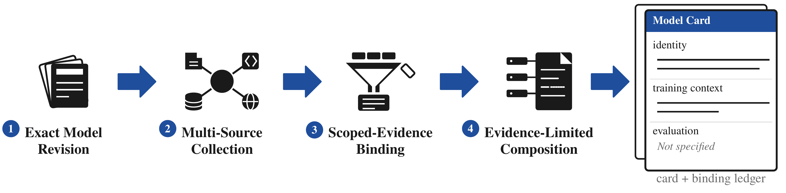

# Model Cards

`modelcards` generates one evidence-bound JSON Model Card for one exact Hugging
Face model revision. It freezes bounded source inputs, extracts only replayable
claims, composes from claims that pass field-scoped gates, runs post-composition
checks, and writes a source-clean public card plus an auditable run record.

The package is deliberately conservative. Unsupported fields remain
`Not specified`; evidence about a base model, sibling checkpoint, family, or
comparison model cannot silently populate an exact-target field. Automated output
uses only `generated_unreviewed` or `generated_validated`. Neither status means that
a person reviewed, approved, or released the card.



The vector [PDF](assets/model-card-pipeline.pdf) and
[LaTeX source](assets/model-card-pipeline.tex) for the figure are included.

## Install

The core package supports Python 3.9 or newer.

```sh
python3 -m pip install -e .
modelcards --help
```

The optional AI Atlas Nexus integration is pinned to `ai-atlas-nexus==1.2.4`.
It requires Python 3.11 or newer and the `risk` extra:

```sh
python3 -m pip install -e '.[risk]'
```

Without that exact dependency, the taxonomy stage reports itself as unavailable;
the core package does not substitute another taxonomy release.

## Generate one card

Pass a Hugging Face model ID, optionally followed by a branch, tag, ref, or exact
commit. Collection resolves it once to a 40-character commit and binds all later
artifacts to that exact target.

```sh
modelcards generate MODEL[@REVISION] --output RUN_DIR
```

The normal networked command performs two bounded collection steps:

1. It freezes selected Hugging Face metadata and files for the resolved revision.
2. It discovers links declared in that frozen material and attempts bounded HTTPS
   collection from the allowlisted publication, code, and declared publisher hosts.

Official-source discovery is declaration-driven. It is not a general web or
scholarly search. Unsafe URLs, redirects, media types, ownership mismatches, size
limits, and unavailable responses are recorded rather than treated as evidence.

Generation without `--provider` does not make paid calls. If the FactReasoner
checker required for the composed claims is unavailable, that gate is recorded as
`unavailable` and the card remains `generated_unreviewed`; deterministic checks do
not promote it past that missing gate.

### Exact offline replay

A verified frozen Hugging Face bundle can be replayed without network access. Add
its ancestry-bound official bundle to replay the combined source state; omit it for
an explicitly Hugging-Face-only replay.

```sh
modelcards generate MODEL@EXACT_COMMIT \
  --offline-bundle HF_BUNDLE \
  --offline-official-bundle OFFICIAL_BUNDLE \
  --output REPLAY_RUN
```

The command rejects target, revision, bundle, source-state, and resume drift. A run
directory admitted in provider-free or provider-assisted mode cannot be resumed in
the other mode.

### Explicit provider-assisted mode

Provider-assisted extraction and semantic checking are opt-in:

```sh
OPENROUTER_API_KEY=... modelcards generate MODEL[@REVISION] \
  --provider Together \
  --output RUN_DIR
```

This mode pins OpenRouter to exactly `deepseek/deepseek-v4-flash-0731` on
`Together`. The CLI rejects every other provider, the runtime verifies the live
endpoint identity and structured-output capabilities before each send, and automatic
fallback is disabled. The runtime has a global run cap of 300 paid calls and USD 25,
permits at most two
retries after an explicit HTTP 429 or 5xx response, and stops on an uncertain send
instead of risking a duplicate. The API key, prompts, source text, and raw response
envelopes are not written to public cards or audit summaries. Private normalized
decision sidecars can contain evidence quotes and proposed values and must stay in the
run directory.

A missing key, invalid route, spend cap, uncertain send, ledger conflict, extraction
failure, or stale resume aborts the run. A safely recorded malformed, truncated, or
retry-exhausted response during an individual claim or FactReasoner check becomes an
explicit `unavailable` decision instead; it cannot count as validation and the card
remains unreviewed. Provider mode is not exposed by `modelcards batch`; run
provider-assisted targets individually so one run owns one global ledger.

## Run artifacts

Each successful run contains a content-addressed, replayable chain. The principal
files are:

| File | Purpose |
| --- | --- |
| `source-bundle/manifest.json` | Exact-revision Hugging Face source inventory |
| `official-discovery.json` | Declared official-source candidates from a networked run |
| `official-source-bundle/manifest.json` | Ancestry-bound official collection inventory, when used |
| `source-state.json`, `source-catalog.json` | Immutable combined source identity and extractable document catalog |
| `extraction.json`, `claim-gates.json` | Candidate claims and the four-part support gate |
| `composition-original.json`, `factreasoner-original.json`, `omissions-original.json` | Pre-repair projection and audits |
| `repairs.json`, `composition.json` | Field-targeted repair/withholding record and post-repair projection |
| `risk-mapping.json`, `factreasoner.json`, `omissions.json`, `privacy.json` | Final risk, factuality, omission, and privacy checks |
| `card-artifact.json`, `public-card.json` | Full typed artifact and source-clean public projection |
| `pipeline-result.json`, `run-manifest.json`, `journal.jsonl` | Run identity, artifact hashes, and append-only stage history |
| `audit-view.json`, `usage-summary.json` | Body-free audit and cost/latency summaries |

Provider-assisted runs additionally retain `provider-orchestration.json`, a single
`usage.jsonl` accounting ledger, normalized decision sidecars, and
`provider-result.json` in the run directory. These are run records, not public-card
content.

## Inspect, validate, review, and repair records

```sh
modelcards validate RUN_DIR/public-card.json
modelcards inspect RUN_DIR/card-artifact.json
modelcards inspect RUN_DIR/card-artifact.json --field training.training_data
```

Generation performs targeted repair and withholding before export and records the
result in `repairs.json`. The `repair` command validates and summarizes one extracted
machine `FieldRepairRecord`; it does not turn that record into human review:

```sh
modelcards repair FIELD_REPAIR_RECORD.json
```

The `review` command appends one explicit decision to a new artifact and leaves its
input untouched:

```sh
modelcards review INPUT_ARTIFACT.json BINDING_ID \
  --action withhold \
  --reason needs_check \
  --output REVIEWED_ARTIFACT.json
```

`accept`, `withhold`, and evidence-preserving `reassign` actions are supported.
Appending a decision does not by itself claim that an entire card was human-reviewed
or released.

## Batch generation and aggregate reports

`targets.json` is a non-empty JSON array of unique `MODEL[@REVISION]` strings.

```sh
modelcards batch targets.json --output BATCH_A
modelcards batch targets.json --output BATCH_B
modelcards report BATCH_A \
  --replay-batch BATCH_B \
  --output quality-report.json
```

Offline batch replay accepts repeatable target-specific mappings:

```sh
modelcards batch targets.json --output BATCH_A \
  --offline-bundle 'MODEL@COMMIT=HF_BUNDLE' \
  --offline-official-bundle 'MODEL@COMMIT=OFFICIAL_BUNDLE'
```

The quality report verifies each typed artifact before aggregating claim outcomes,
withholding, omissions, risk-stage status, usage, cost/latency, and paired replay
stability. It contains hashes and closed counters, not source bodies or provider
payloads. These are engineering validation measures, not human quality judgments or
evidence that this generator is better than another system.

## Example cards

The repository contains three real public projections produced by the current
pipeline from exact-revision canary bundles. All three passed schema, claim-support,
conflict, omission, risk-stage, and privacy checks. Their FactReasoner gates were
unavailable, so they correctly remain `generated_unreviewed` and intentionally sparse.

| Card | Exact revision | Lifecycle |
| --- | --- | --- |
| [OLMo-2-1124-7B](cards/olmo-2-1124-7b.json) | `7df9a82518afdecae4e8c026b27adccc8c1f0032` | `generated_unreviewed` |
| [OLMo-2-1124-7B-Instruct](cards/olmo-2-1124-7b-instruct.json) | `470b1fba1ae01581f270116362ee4aa1b97f4c84` | `generated_unreviewed` |
| [Mistral-7B-v0.3](cards/mistral-7b-v0.3.json) | `caa1feb0e54d415e2df31207e5f4e273e33509b1` | `generated_unreviewed` |

The examples are published mechanically, without factual hand edits. The publishing
script validates the packaged schema and privacy boundary, then copies each generated
card byte-for-byte:

```sh
PYTHONPATH=src python3 scripts/publish_examples.py --force \
  GENERATED_A/public-card.json=cards/example-a.json \
  GENERATED_B/public-card.json=cards/example-b.json
```

## Scope and current limitations

- Official discovery follows declarations in the frozen Hugging Face material; it
  does not independently search the literature.
- Bounded official collection can freeze supported HTTPS responses, but the current
  official-document bridge does not extract text from PDFs.
- Provider-assisted batch execution is intentionally unavailable.
- Missing provider credentials or an unavailable FactReasoner backend are reported;
  they are not replaced with invented validation results.
- The example cards are automated candidates. This repository reports no human study,
  human annotation result, released card, independent-model comparison result, or
  demonstrated quality improvement over another generator.
- Empty or `Not specified` risk fields mean that no eligible entry was produced from
  the retained source state and available checks. They do not establish absence of
  risk.

The [JSON Schema](schema/model-card.schema.json) is the public contract. See
[ARCHITECTURE.md](ARCHITECTURE.md) for the typed stages, replay invariants, provider
boundary, and publication boundary.

## Test

```sh
PYTHONPATH=src python3 -m pytest -q
```

The test suite is deterministic and uses fixtures or injected transports; paid
provider calls are not part of the default tests.

## License

MIT. See [LICENSE](LICENSE) and [NOTICE.md](NOTICE.md).
