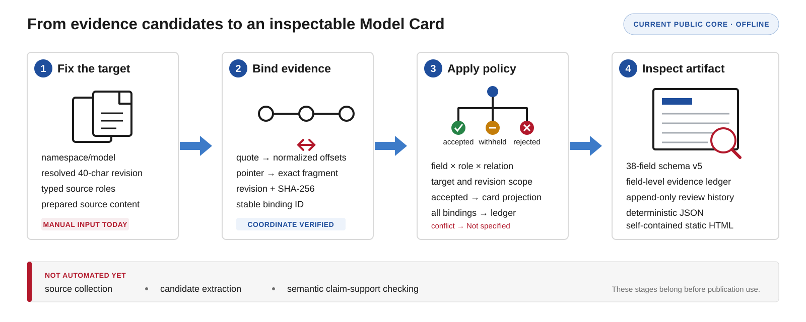

# Pipeline and evidence contract

This note describes the public core as it exists now. The starting point is a
prepared JSON specification. The endpoint is an inspectable artifact for one
exact model revision.

## Status by step

| Step | What happens | State |
| --- | --- | --- |
| Fix the target | Record one `namespace/model` and one resolved 40-character revision | Implemented |
| Prepare sources | Supply pinned metadata, text, reports, code, or index records | Manual input |
| Propose bindings | Connect a source fragment and value to a schema field | Manual input |
| Verify coordinates | Match an exact quote or resolve a JSON Pointer and retain its digest | Implemented |
| Check scope | Check the claim entity, source revision, relation, field policy, and conflicts | Implemented |
| Check claim support | Test whether the evidence supports the proposed value and field | Next build phase |
| Project the card | Fill accepted fields and leave unresolved fields as `Not specified` | Implemented |
| Inspect and review | Render JSON or HTML and append review events | Mechanism implemented, protocol later |

## Input contract

Each specification has three parts.

`target` names one model and one resolved revision. `sources` contains the
material supplied for the run. A source records its role, revision, target
scope, synthetic status, and either text or structured data. `candidates`
proposes a value for a schema field and states what entity the claim refers to.

The current CLI expects these parts to be prepared before the build begins.
This keeps the policy core small enough to inspect, but it means the repository
does not yet contain an end-to-end collection system.

## Stage 1. Fix the target

The target key is `namespace/model@revision`. The revision must be a resolved
40-character lowercase commit. This prevents a moving branch or tag from
silently changing the subject of the card.

Hugging Face metadata and snapshot evidence must use the same resolved
revision. Developer code must also name a resolved commit. A report or index
record may use its own stable revision label, but its target scope remains
explicit.

## Stage 2. Bind evidence

A binding connects one proposed value to one card field. It records the claim
entity, its relation to the target, and the evidence coordinates.

Quoted evidence stores the normalized quote and its character offsets in the
normalized source text.
Structured evidence stores a non-root RFC 6901 JSON Pointer and the resolved
fragment. Both forms retain the source ID, role, revision, SHA-256 digest, and
declared source target. The binding ID is derived from this content.

Source content is used during the build and replay checks. Full source
documents are not copied into the card artifact.

## Stage 3. Apply policy

The current policy is deliberately narrow.

| Result | Meaning | Projection |
| --- | --- | --- |
| `accepted` | The binding passes the current coordinate, target, relation, role, and field rules | Its value may enter the card |
| `withheld` | The evidence is retained but its scope or permitted use does not support target projection under current policy | The field stays unfilled |
| `rejected` | The constructed binding is unverifiable or inconsistent with a hard rule | The field stays unfilled |
| conflict flag | Two accepted bindings propose different values for the same field | The field stays unfilled and both bindings are flagged |

Family facts do not transfer to a checkpoint. Base-model evidence may populate
only the explicit `lineage.base_models` field. Comparison and sibling relations
may populate only score-free links in `evaluation.related_model_scores`. EEE
records are link and discovery evidence, not authority for a checkpoint score.

The card uses no last-write-wins rule. Withheld and rejected candidates remain
in the ledger with stable reason codes.

## Stage 4. Inspect the artifact

The JSON artifact contains four top-level records.

| Record | Contents |
| --- | --- |
| `target` | Exact model identity and revision |
| `card` | Complete schema v5 projection with 38 fields |
| `bindings` | Generated evidence ledger with all dispositions |
| `reviews` | Append-only review events |

Five fields under `provenance_and_quality` are computed from the ledger. They
record field provenance, flags, missing fields, a coverage score, and basic
artifact information. They never receive evidence bindings themselves.

The HTML renderer turns the same artifact into a self-contained inspection
page. It contains no scripts and makes each binding visible beside its reason
and coordinates.

## What verification means

The current core verifies coordinates and declared scope. A verified quote
means that the quoted text occurs at the stored offsets in normalized source
text. A verified pointer means that the stored fragment resolves at that
location in the pinned structured source.

Neither check establishes semantic entailment. A quote can occur in a source
while failing to support the proposed value. A structured fragment can be
real while being mapped to the wrong field. Until the semantic support gate and
human review protocol are in place, `accepted` means accepted by the current
policy. It does not mean publication-ready fact.

## Source roles

| Role | Permitted use in the baseline |
| --- | --- |
| Exact Hugging Face metadata | Identity and explicit structured facts at a resolved revision |
| Selected Hugging Face snapshot file | Exact-revision developer text |
| Developer report | Report evidence with an explicit target |
| Pinned developer code | Developer-owned documentation at a resolved commit |
| EEE index | Links and external-record discovery |
| Synthetic input | Redistributable tests and examples |

Search results, mirrors, generic leaderboards, and third-party commentary do
not have source roles in this baseline. Adding a role should come with a field
policy and matching failure tests.

## How card quality will be measured

The code already tests determinism, replay, target identity, scope policy,
conflict behavior, review history, and serialization integrity. The checked-in
cards exercise those mechanics.

They do not measure factual quality on real models. The planned pilot needs
field-level labels for correct support, wrong scope, wrong field, conflict,
missing evidence, and justified abstention. The evaluation should report
precision and error counts alongside coverage. A high coverage score alone is
not a success criterion.

## Next build phase

The first missing gate is semantic claim support. It should reject a proposed
field value when the stored fragment does not support that value and field,
even when the coordinates are valid. Adversarial fixtures should cover copied
quotes with altered values, wrong-field mappings, negation, family-to-model
transfer, and score-setting mismatches.

The first source adapter should pin a Hugging Face revision, collect its
metadata and a small allowlist of snapshot files, assign source roles, and emit
prepared source records. Candidate extraction can then begin with deterministic
metadata mappings before any model-assisted proposal step is considered.

After those gates pass locally, a three-model pilot should expose failure
classes. A twelve-model evaluation can follow once the policy and schema stop
changing under routine cases.
